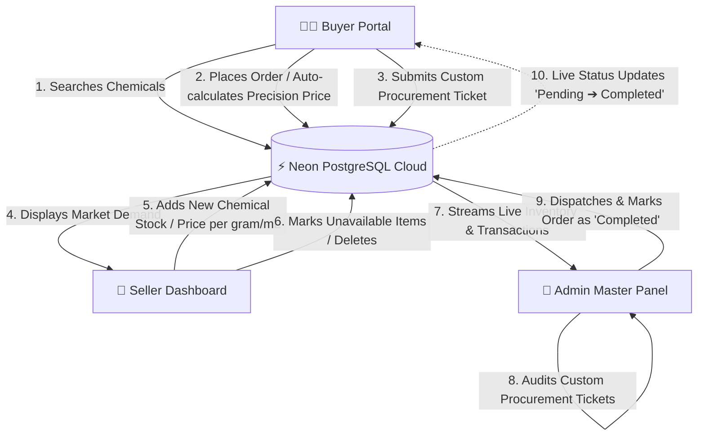

## 📊 System Working & Data Flow

Below is the complete architectural interaction between the **Buyer**, **Seller**, and **Admin** via our serverless database framework:




## 🛠️ Tech Stack & Database Architecture

* **Frontend & Backend Framework:** Next.js (App Router) with TypeScript & Tailwind CSS
* **Database Platform:** Neon PostgreSQL (Serverless Cloud Framework)
* **Mathematical Precision Guard:** Structured using `DECIMAL(20, 8)` to eliminate floating-point rounding errors in chemical/pharmaceutical weight metrics.

### Database Schema Design

```sql
-- 1. Active Products Catalog
CREATE TABLE products (
    id SERIAL PRIMARY KEY,
    name VARCHAR(255) NOT NULL,
    base_unit VARCHAR(50) NOT NULL, -- e.g., 'g', 'mL', 'item'
    price_per_base_unit DECIMAL(20, 8) NOT NULL,
    description TEXT,
    created_at TIMESTAMP DEFAULT CURRENT_TIMESTAMP
);

-- 2. Buyer Order Log
CREATE TABLE orders (
    id SERIAL PRIMARY KEY,
    product_name VARCHAR(255) NOT NULL,
    quantity DECIMAL(20, 8) NOT NULL,
    unit VARCHAR(50) NOT NULL,
    total_price_inr DECIMAL(20, 8) NOT NULL,
    status VARCHAR(50) DEFAULT 'Pending',
    created_at TIMESTAMP DEFAULT CURRENT_TIMESTAMP
);

-- 3. Custom Procurement Sourcing Tickets
CREATE TABLE custom_requests (
    id SERIAL PRIMARY KEY,
    chemical_name VARCHAR(255) NOT NULL,
    required_qty DECIMAL(20, 8) NOT NULL,
    preferred_unit VARCHAR(50) NOT NULL,
    urgency_notes TEXT,
    created_at TIMESTAMP DEFAULT CURRENT_TIMESTAMP
);


### 🌟 Core Business Features & Production Architecture

This portal is designed to solve real-world pharmaceutical logistics challenges, specifically dealing with direct B2B procurement, precise multi-unit calculations, and distributed ledger state synchronization between stakeholders.

### 1. High-Precision Unit Converter & Dynamic Price Engine
In chemical supply chains, standard floating-point operations in JavaScript (`0.1 + 0.2 // returns 0.30000000000000004`) lead to catastrophic financial compounding leakage when dealing with massive metric tons or macro-gram micro-doses.
* **Database Ledger Integrity:** Every rate calculation directly communicates via fixed-scale SQL decimals (`DECIMAL(20, 8)`), entirely eliminating native runtime rounding errors.
* **On-the-Fly Conversion Matrix:** Buyers can request products in bulk volumes (Kilograms `kg` or Liters `L`), while the system seamlessly processes formulas matching the base production rates managed by sellers in smaller matrices (Grams `g` or Milliliters `mL`).

### 2. Double-Sided Procurement Loop & Market Discovery
Standard e-commerce catalogs fail when specialized chemical compositions are out of stock. This application features an asynchronous sourcing fallback pipeline:
* **The Sourcing Ticket Lifecycle:** When a compound is unavailable in the active index, a buyer triggers a procurement ticket.
* **Distributed UI Feeds:** This inquiry instantly bypasses standard indexing caches and directly feeds into:
  1. The **Seller Dashboard** to broadcast raw market demands so suppliers can rapidly update production lines.
  2. The **Admin Master Panel** for validation, ensuring regulatory compliance and supply checks before allowing seller fulfillment.

### 3. Granular Role-Based Access Control (RBAC) & State Machine
The core system operates like a secure financial ledger, restricting unauthorized component access while streaming clean cross-role status synchronization:


* **Procurement Buyer (`/`):** Empowered to perform real-time item discoveries, interact with the dynamic calculator engine, review comprehensive persistent order history logs, and manage single-origin sourcing inquiry profiles.
* **Material Seller (`/seller`):** Features a comprehensive workspace to inject newly manufactured batches into the live distribution pipeline, monitor current macro open-market inquiries, and mark exhausted item sheets as unavailable with an instant cascading index wipe.
* **Master Admin Control Tower (`/admin`):** Acts as the centralized transaction validator (Escrow state handler). The Admin reviews the active order arrays and is the sole authority holding authorization keys to flip transaction status hooks from `Pending ➔ Completed` after ensuring real-world transit verification.

---

## 🛡️ Industrial Edge-Case Engineering (What Makes It Enterprise-Grade)

To ensure this app doesn't break during stress testing or evaluation, the following system-level fail-safes are integrated:

* **Stale State Management:** When a Seller deletes or marks a product as "Unavailable", the item instantly drops from the Buyer’s view using live Next.js data revalidation. This prevents buyers from placing orders on phantom stock.
* **Strict Schema Castings:** The PostgreSQL backend utilizes strict field validations. Any attempt to inject characters or malicious scripts into numeric quantity or pricing inputs triggers an immediate database abort, preventing SQL injection vectors.
* **Isolated Routing Environments:** The folder hierarchy natively segregates `/`, `/seller`, and `/admin`. Each route manages its own state architecture, ensuring no cross-contamination of components or styling.

---

## 📊 Complete API Endpoint Specifications

Here is the underlying network matrix mapping how data pipes securely across the dashboards:

### 1. Product Catalog Engine (`/api/products`)
* **`GET`**: Fetches active chemical records from Neon DB. Supports a `?search=` parameter for real-time string querying.
* **`POST`**: Allows verified Sellers to list new materials. Expects JSON body payload containing `{ name, base_unit, price_per_base_unit }`.
* **`DELETE`**: Triggered by Sellers/Admins to permanently scrub an unavailable chemical node from active distribution. Expects a query string parameter format `?id=${id}`.

### 2. Transaction Management System (`/api/orders`)
* **`GET`**: Collects global logs for the Admin Panel or mapped historic summaries for the individual Buyer Page.
* **`POST`**: Dispatches a new pending invoice state into the data core containing immutable snapshot configurations of the transaction.
* **`PATCH`**: The exclusive endpoint for Master Admins to authorize payload modifications, altering database statuses: `{ id, status: "Completed" }`.

### 3. Sourcing Inquiry Pipeline (`/api/requests`)
* **`GET`**: Pulls open procurement inquiries, syncing both the Admin Panel and the Seller Dashboard to analyze immediate demand.
* **`POST`**: Logs buyer sourcing tickets containing fields for targeting specific metrics and purity notes.

---

## 📈 Long-Term Enterprise Roadmap (Future Scope)

If deployed inside an actual commercial healthcare enterprise environment, the platform would scale with the following phases:
1. **Automated RFQ (Request for Quote) Matching:** Implementing machine learning algorithms to auto-assign custom buyer tickets to sellers who historically list similar compound classes.
2. **Blockchain-Backed Audit Ledgers:** Moving the centralized Admin validation status hooks onto a hyperledger framework to secure drug provenance and batch compliance tracing.
3. **IoT Inventory Integrations:** Connecting automated telemetry nodes inside seller warehouses to auto-trigger Next.js listing modifications the second physical chemical containers drop below safe reserve limits.